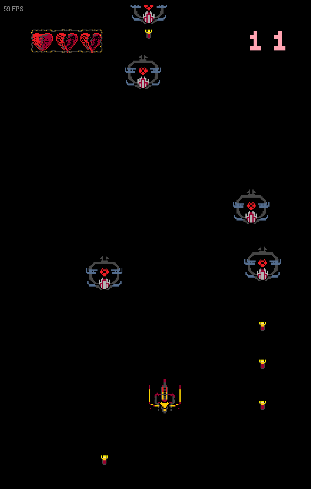
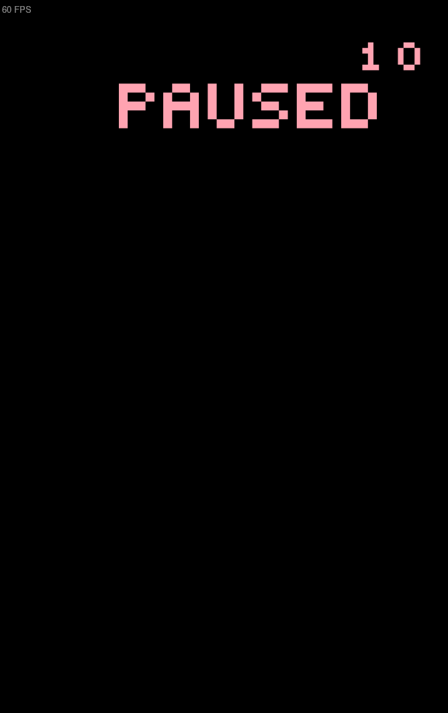

# go-spacewar  
*A 2D Space Shooter Game Built with Go and Ebiten*  

   

**go-spacewar** is a small 2D game developed as a learning project to learn basic Go syntax. One of the first go programs i ever wrote.  

---

## Features  
- **Controls**:  
  - **WASD** for spaceship movement  
  - **Shift** key to fire weapons  
- **Basic Physics**: Implement collision detection and projectile mechanics  
- **Graphics**: Pixel-art-style for simplicity  
---

## Gameplay Preview  

  
  
   
  <em>Left: Active gameplay | Right: Pause menu </em>

---

## Installation  
You can just download the release suited to your os.
